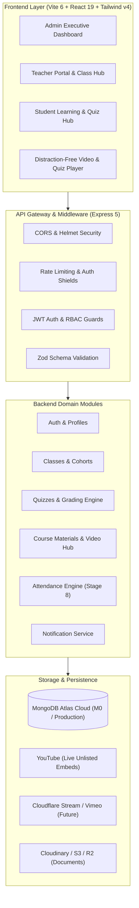
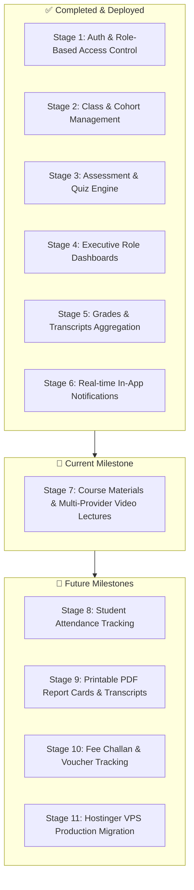

# The Girls Kingdom School and College Mardan
## Master Architecture, System Design & Global Implementation Roadmap

This document serves as the single source of truth for the architecture, data models, completed features, and future development stages of **The Girls Kingdom School and College Mardan Web Portal & Learning Management System (LMS)**.

---

## 🏛️ System Architecture Overview



---

## 📊 Complete Milestone Roadmap (Stages 1 – 11)



---

### Milestone Breakdown

| Stage | Module | Status | Deliverables & Scope |
| :--- | :--- | :---: | :--- |
| **Stage 1** | **Authentication & RBAC** | ✅ Live | JWT authentication, student/teacher registration, password changes, bcrypt security (12 rounds). |
| **Stage 2** | **Institutional Management**| ✅ Live | Classes/cohorts CRUD, student active enrollments, faculty class assignments. |
| **Stage 3** | **Assessment Engine** | ✅ Live | MCQ, True/False auto-grading, Comprehensive evaluation queues, 30s auto-save, timer auto-submit. |
| **Stage 4** | **Role Dashboards** | ✅ Live | Custom Admin metrics, Teacher class views, Student enrolled courses overview. |
| **Stage 5** | **Grades & Transcripts** | ✅ Live | Score calculation, percentage averaging, pass/fail status, attempt history. |
| **Stage 6** | **Notification Engine** | ✅ Live | In-app alerts on quiz publish, submission, grading, and enrollment. |
| **Stage 7** | **Course Materials & Videos** | 🚀 **In Progress** | **YouTube live video lectures**, Cloudflare Stream / Vimeo mockups, PDF notes & syllabus sharing. |
| **Stage 8** | **Attendance Management** | 📋 Planned | Daily roll-call per period, student attendance percentage meters, absenteeism warnings. |
| **Stage 9** | **Printable PDF Reports** | 📋 Planned | Institutional PDF generator for term transcripts and report cards with college seal. |
| **Stage 10** | **Fee Tracking** | 📋 Planned | Challan vouchers, monthly tuition payment status (Paid/Pending/Overdue). |
| **Stage 11** | **Hostinger VPS Migration**| 📋 Planned | Nginx reverse proxy, PM2 process manager, SSL certificates, custom institutional domain. |

---

## 🗄️ Entity-Relationship & Database Schema

```mermaid
erDiagram
    User ||--o| StudentProfile : "has"
    User ||--o| TeacherProfile : "has"
    User ||--o{ Enrollment : "enrolled in"
    User ||--o{ TeacherAssignment : "assigned to"
    User ||--o{ Attempt : "takes"
    User ||--o{ Notification : "receives"

    Class ||--o{ Enrollment : "contains"
    Class ||--o{ TeacherAssignment : "taught by"
    Class ||--o{ Quiz : "scheduled for"
    Class ||--o{ Material : "contains"

    Quiz ||--o{ Attempt : "attempted via"
    Quiz }|--|| User : "created by teacher"
    Material }|--|| User : "uploaded by teacher"

    User {
        ObjectId _id
        String fullName
        String email
        String password
        String role
        Boolean isActive
    }

    Class {
        ObjectId _id
        String name
        String code
        String academicYear
        String status
    }

    Material {
        ObjectId _id
        ObjectId class
        ObjectId teacher
        String title
        String category
        Object video
        Object document
        Boolean isPublished
    }

    Quiz {
        ObjectId _id
        ObjectId class
        ObjectId teacher
        String title
        Array questions
        Number duration
        Number totalMarks
        String status
    }

    Attempt {
        ObjectId _id
        ObjectId quiz
        ObjectId student
        String status
        Number obtainedMarks
        Number percentage
        Boolean isPassed
    }
```

---

## 📹 Video Streaming Architecture (Stage 7 Design)

### 1. YouTube Live Integration (Phase 1 — Current)
* **Storage & Bandwidth**: \$0 (100% Free, unlimited bandwidth on YouTube servers).
* **Adaptive Bitrate Streaming**: Automatically switches resolutions (1080p, 720p, 480p, 360p) for students across varying mobile connections in Mardan and KP.
* **URL Parser Algorithm**: Supports all YouTube link formats:
  - Standard: `https://www.youtube.com/watch?v=VIDEO_ID`
  - Shortened: `https://youtu.be/VIDEO_ID`
  - Embed: `https://www.youtube.com/embed/VIDEO_ID`
  - Shorts: `https://www.youtube.com/shorts/VIDEO_ID`
* **Student Player**: Sandboxed inside an iframe with `rel=0` and custom theater mode controls.

### 2. Cloudflare Stream & Vimeo Pro Integration (Phase 2 — Future Cloud Ready)
* **Provider-Agnostic Schema**: The `Material` document contains a `video.provider` discriminator (`['youtube', 'cloudflare', 'vimeo']`).
* **Cloudflare Stream Benefits**: Domain lock (restricting video playback exclusively to `girlskingdom.edu`), token signing, zero video download buttons.
* **UI Mockup in Stage 7**: Styled UI tabs with credentials/token inputs and mock preview states so the interface is fully ready before connecting enterprise API keys.

---

## 🛡️ Defensive Engineering & Bug Prevention Standards

To ensure stability across serverless (Vercel) and standalone VPS (Hostinger) environments, adhere to these architectural rules:

1. **Serverless Database Connection Safety**:
   - Always reuse the existing Mongoose connection (`mongoose.connection.readyState >= 1`) to prevent exhausting MongoDB Atlas connection limits during serverless cold starts.
   - Run auto-seeding guards (`let isSeeded = false`) in API middleware so fresh databases are initialized automatically without crashing serverless handlers.
2. **CORS & Authentication Protection**:
   - Never reflect arbitrary origins when `credentials: true` is enabled in production. Whitelist institutional domains and Vercel preview regexes strictly.
3. **SPA Client-Side Routing Fallback**:
   - Ensure all non-API paths rewrite to `index.html` so browser page refreshes on `/login`, `/dashboard`, or `/student/quizzes` never return 404.
4. **Auth Interceptor Safety**:
   - Exempt `/api/auth/login` from automatic 401 redirect handlers to prevent infinite page reloads on incorrect password entries.
5. **Fire-and-Forget Notifications**:
   - Notifications triggered by background actions (material published, quiz graded, class enrolled) must execute inside `setImmediate()` or async background blocks so that notification delivery errors never block the primary transaction.

---

## 🚀 Deployment Environment Strategy

| Component | Vercel (Current Testing) | Hostinger VPS (Production Goal) |
| :--- | :--- | :--- |
| **Frontend** | Static Vite SPA with client-side rewrites | Nginx serving `dist/` with gzip & HTTP/2 |
| **Backend API** | Serverless Node.js functions | Node.js managed via **PM2** cluster mode |
| **Database** | **MongoDB Atlas** (M0 Free Tier) | **MongoDB Atlas** (Cloud-backed with automated backups) |
| **Media / Files** | YouTube (Videos) + Cloudinary/R2 (Docs) | YouTube / Cloudflare Stream + Nginx `/uploads` or S3 |
| **SSL / Domain** | Auto Vercel SSL (`*.vercel.app`) | Let's Encrypt SSL (`https://girlskingdom.edu.pk`) |
